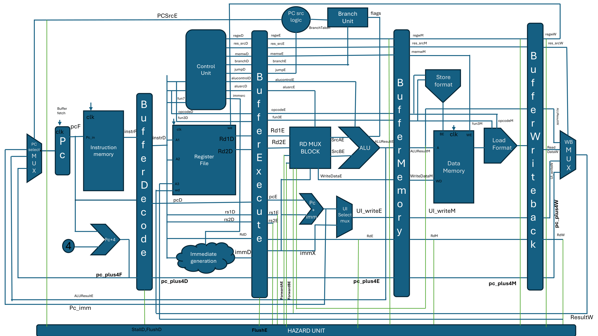

# risc-V
# 32-bit 5-Stage Pipelined RISC-V Processor (RV32I)

A 32-bit five-stage pipelined RISC-V (RV32I) processor implemented in Verilog HDL. The processor supports the base integer instruction set with hazard detection, data forwarding, branch handling, and functional verification through simulation.

---

## Features

- 32-bit RV32I processor
- Five-stage pipeline
  - Instruction Fetch (IF)
  - Instruction Decode (ID)
  - Execute (EX)
  - Memory Access (MEM)
  - Write Back (WB)
- Data Hazard Detection
- Data Forwarding Unit
- Load-Use Hazard Stall
- Branch & Jump Support
- Immediate Generator
- Register File
- ALU
- Instruction Memory
- Data Memory
- Functional Verification
- FPGA Synthesis (Vivado)

---

## Supported Instructions

### R-Type
- ADD
- SUB
- AND
- OR
- XOR
- SLL
- SRL
- SRA
- SLT
- SLTU

### I-Type
- ADDI
- ANDI
- ORI
- XORI
- SLTI
- SLTIU
- SLLI
- SRLI
- SRAI

### Load
- LW
- LH
- LHU
- LB
- LBU

### Store
- SW
- SH
- SB

### Branch
- BEQ
- BNE
- BLT
- BGE
- BLTU
- BGEU

### Jump
- JAL
- JALR

### Upper Immediate
- LUI
- AUIPC

---

# Processor Architecture

<p align="center">

</p>

---

# Pipeline

```
        IF
         │
         ▼
        ID
         │
         ▼
        EX
         │
         ▼
        MEM
         │
         ▼
        WB
```

Pipeline registers:

- IF/ID
- ID/EX
- EX/MEM
- MEM/WB

---

# Hazard Handling

Implemented mechanisms:

- Data Forwarding
- Load-Use Hazard Detection
- Pipeline Stall
- Pipeline Flush
- Branch Redirection

---

# Repository Structure

```
.
├── rtl/
│   ├── ALU.v
│   ├── Hazard_unit.v
│   ├── control_unit.v
│   ├── RISC_TOP.v
│   ├── ...
│
├── tb/
│   └── testbench.v
│
├── mem/
│   └── memfile.hex
│
├── constraints/
│   └── constraints.xdc
│
├── reports/
│   ├── timing_report.pdf
│   ├── utilization_report.pdf
│   └── synthesis_report.pdf
│
├── images/
│   ├── processor_architecture.png
│   ├── datapath.png
│   ├── forwarding.png
│   ├── waveform.png
│   └── synthesis.png
│
└── README.md
```

---

# Verification

The processor was functionally verified using simulation.

Instruction verification includes:

- Arithmetic Instructions
- Logical Instructions
- Shift Instructions
- Load Instructions
- Store Instructions
- Branch Instructions
- Jump Instructions
- Upper Immediate Instructions

An integrated test program was executed to verify:

- Register Writeback
- Memory Read/Write
- Pipeline Forwarding
- Hazard Detection
- Branch Redirection
- Control Flow

---

# Synthesis

Tool:

- AMD Vivado

Target FPGA:

- Artix-7 (xc7a200tfbg676-3)

Timing analysis and resource utilization reports are included in the `reports` directory.

---

# Future Improvements

- Branch Prediction
- CSR Support
- Exception Handling
- Interrupt Support
- Multiplier / Divider Extension
- Cache Interface
- AXI4-Lite Interface

---

# Acknowledgements

The overall processor organization was developed with reference to publicly available educational resources on pipelined RISC-V processors. The RTL implementation, verification, debugging, and subsequent enhancements in this repository were independently developed.

---

# Author

**Sathwik B**

M.Tech – VLSI Design
